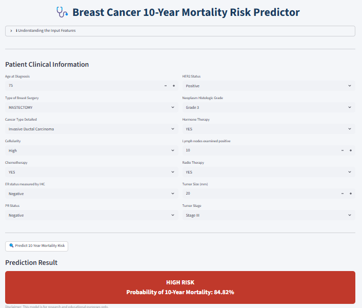

# Breast Cancer 10-Year Mortality Prediction

# 📌 Project Overview

This project predicts the **10-year mortality risk in breast cancer patients** using machine learning and survival analysis techniques on the **METABRIC clinical dataset**.

The objective is to build an **interpretable model** that can help identify high-risk patients based on clinical features such as tumor stage, tumor size, treatment type, and hormone receptor status.

The project combines **machine learning classification** with **survival analysis** to better understand long-term patient outcomes.

---

# 🚀 Live Application

Try the deployed model here:

https://breast-cancer-10yr-mortality-prediction.streamlit.app/

---

# 📷 Application Preview



---

# 📊 Dataset

METABRIC Breast Cancer Dataset containing clinical information including:

- Age at diagnosis
- Tumor stage
- Tumor size
- ER / PR / HER2 receptor status
- Type of breast surgery
- Chemotherapy
- Radiotherapy
- Hormone therapy
- Lymph nodes examined positive
- Histologic grade
- Cellularity

---

# ⚙️ Models Evaluated

The following models were trained and evaluated:

- Logistic Regression
- Decision Tree
- Support Vector Machine (SVM)

**Logistic Regression was selected as the final model** due to its strong recall for mortality prediction and interpretability for healthcare applications.

---

# 📈 Model Evaluation

Evaluation metrics used:

- Accuracy
- ROC-AUC
- Confusion Matrix
- Cross-Validation

The project prioritizes **reducing false negatives**, since predicting that a high-risk patient will survive can have serious clinical implications.

---

# 📊 Survival Analysis

Kaplan-Meier survival curves were generated to visualize **survival probability over time**, complementing the machine learning model with time-to-event analysis.

---

# 🛠 Tech Stack

- Python
- Pandas
- NumPy
- Scikit-Learn
- Matplotlib
- Lifelines
- Streamlit

---

# 📂 Project Structure

```
breast-cancer-10yr-mortality-prediction

│
├── app.py
├── breast_cancer_10yr_pipeline.pkl
├── requirements.txt
├── app_screenshot.png
├── Breast_Cancer_10yr_Mortality_Prediction.ipynb
└── README.md
```

---

# 💡 Future Improvements

- Add Cox Proportional Hazards survival model
- Expand model comparison with ensemble models
- Improve UI with additional survival visualizations
- Deployment as clinical decision support tool


---
# 📬 Contact

If you found this project interesting or have suggestions, feel free to connect.


# 👩‍💻 Author


Tabassum Shaikh  

Aspiring Data Scientist | Machine Learning \& Healthcare Analytics

